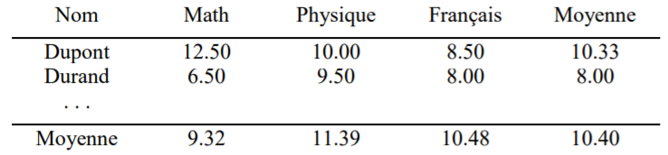
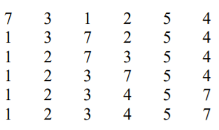

=== "TD 8"
    ## 1. 
    Trouver une définition récursive du PGCD de deux entiers et écrire l’algorithme correspondant.

    ??? abstract "Réponse"

        PGCD(A,B):
            A, B : entiers
                
            début
                si A mod B = 0
                    alors
                        retourner B
                sinon
                    retourner PGCD(B,A mod B)
            fin

    ## 2. 
    Trouver un algorithme récursif permettant de calculer la puissance d’un nombre x^y. Attention : y pourra être éventuellement négatif

    (insérer image)

    ??? abstract "Réponse"

        Puissance(x,y):
            x, y : réels
               
            début
                si y=0
                    alors
                        retourner 1
                si y>0
                    alors
                        retourner x*Puissance(x,y-1)
                    sinon
                        retourner (1/x)*Puissance(x,y+1)
            fin            

    ## 3. 
    Trouver un algorithme récursif permettant d’inverser une chaîne de caractères (‘NF01’ devient ‘10FN’, ‘bonjour’ devient ‘ruojnob’…).

    ??? abstract "Réponse"

        Inversion(S):
            S : chaîne
                
            début
                si S=" "
                    alors
                        retourner S
                    sinon
                        retourner Inversion(copie(S,2,longueur(S)))+S[1]
            fin

    ## 4. 
    En déduire un algorithme permettant d’indiquer si un mot est un palindrome (identique à l’endroit et à l’envers, par exemple : ‘noyon’ ou ‘rever’).

    ??? abstract "Réponse"

        Palindrome(S):
            S : chaîne
                
            début
                si longueur(S)<=1
                    alors
                        retourner Vrai
                    sinon
                        si S[1]=S[longueur[S]]
                            alors
                                retourner Palindrome(copie(S,2,longueur(S)-1))
                            sinon
                                retourner Faux
            fin

    ## 5. 
    Ecrire une version récursive de l’algorithme de recherche dichotomique.
    ??? info "Recherche dichotomique"
        On rappelle que la recherche dichotomique est une recherche par approximations successives dans une liste ordonnée (triée par ordre croissant de ses valeurs). On compare l'élément recherché à celui situé en milieu de liste. S'il est plus grand, on recommence avec la moitié supérieure de la liste, sinon avec la moitié inférieure de la liste, jusqu'à convergence vers l'élément recherché (égalité = succès), ou jusqu'à ce qu'il n'y ait plus aucun élément à comparer (liste vide). Dans ce cas, l'élément recherché était absent de la liste. Ecrire un algorithme dichotomie permettant d'effectuer une recherche dichotomique dans un tableau de 100 entiers.
    
    ??? abstract "Réponse"

        Dicho(T,val,d,f):
            T : tableau
            val : entier
            d,f : entiers
              
            début
                si d > f
                    alors
                        retourner 0
                    sinon
                        n <--- (d+f)/2
                        si T[n] = val
                            alors
                                retourner n
                            sinon
                                si val>T[n]
                                    alors
                                        retourner Dicho(T,val,n+1,f)
                            sinon
                                retourner Dicho(T,val,d,n-1)
            fin

=== "TD 9"
    ##1.
    Définir le type date permettant de représenter une date comportant le numéro du jour et le numéro du mois (14 7, 25 12, 31 12, ...).  
    Ecrire un algorithme jour_du _lendemain qui détermine la date du lendemain d’un jour donné. On supposera que l’année n’est pas bissextile.

    ??? abstract "Réponse"

        date = enregistrement
            jour : entier (1,31)
            mois : entier (1,12)
        Algorithme jour_du_lendemain
            variables : 
                d1,d2 : date
                max_j : entier
            début
                Afficher("Donnez une date : jour et mois)
                lire(d1.jour,d1.mois)
                si(d1.mois = 2)
                    alors
                        max_j <--- 28
                    sinon si (d1.mois est dans [1,3,5,7,8,10,12])
                        alors
                            max_j <--- 31
                        sinon
                            max_j <--- 30
                d2.jour <--- d1.jour + 1
                si (d2.jour > max_j)
                    alors
                        d2.jour <--- 1
                si (d2.jour = 1)
                    alors
                        d2.mois <--- d1.mois + 1
                        si (d2.mois = 13)
                            alors
                                d2.mois <--- 1
                sinon
                    d2.mois <--- d1.mois
                Afficher("Le jour suivant est", d2.jour, d2.mois)
            fin
    Il faudrait compléter l'algorithme avec une fonction de vérification de la cohérence de la date

    ##2.
    Un supermarché désire créer un tableau contenant la liste des prix de tous les articles disponibles en rayon. Ecrire un algorithme qui écrit dans un tableau la liste des articles avec leur prix (entrés au clavier). On désire ensuite calculer le prix moyen des articles en rayon. On aimerait, pour conclure, rechercher le nombre d'articles pour lesquels le prix est supérieur à un tarif entré par l'utilisateur. Par exemple, on voudrait savoir combien d'articles sont vendus à plus de 500 euros. 

    ??? abstract "Réponse"

        article = enregistrement
            nom : chaîne
            prix : réel
        Algorithme
            variables :
                i, N, Taille, nb : entier
                S, Tarif : réel
            début
                #Saisie des articles
                afficher ("Combien y a-t-il d'article ?")
                lire (N)
                T : tableau de N article           
                i <--- 0
                répéter
                    i <--- i + 1
                    afficher("Nom de l'article :")
                    lire(T[i].nom)
                    afficher("Prix de l'article :")
                    lire(T[i].prix)
                tant que (T[i].prix > 0 et i <= N)
                Taille <--- i - 1

                #Prix moyen
                pour i variant de 1 à Taille 
                    S <--- S + T[i].prix
                afficher("Le prix moyen des articles est", S/Taille)

                #Recher articles sup
                afficher ("Donnez un prix"
                lire(Tarif)
                nb <--- 0
                pour i variant de 1 à Taille
                    si(T[i].prix >= Tarif)
                        alors
                            nb <--- nb + 1
                afficher(nb, "articles dont le prix est supérieur ou égal au tarif entré")

    ##3.
    On dispose d’un tableau d’enregistrements ayant la structure suivante : nom, prénom, âge.  

    a) Ecrire un algorithme avec un MENU permettant de proposer l’ensemble des actions à réaliser (cf liste ci-dessous). Une boucle sera effectuée jusqu’à ce que l’utilisateur ait choisi 0 pour sortir. L’algorithme vérifiera que le choix de l’utilisateur est un chiffre compris entre 0 et 6. Si ce n’est pas le cas, son choix lui sera demandé à nouveau.  

    ??? abstract "Réponse"

        etudiant = enregistrement
            nom : chaîne
            prenom : chaîne
            age : entier
        
        Algorithme MENU
            variables
                choix : entier
            début
                répéter
                    afficher("Tapez 1 : Stockage des informations des étudiants dans le tableau")
                    afficher("Tapez 2 : Afficher l’ensemble du tableau (liste de tous les étudiants)")
                    afficher("Tapez 3 : Ajout d’un étudiant")
                    afficher("Tapez 4 : Recherche d’un étudiant")
                    afficher("Tapez 5 : Suppression d’un étudiant")
                    afficher("Tapez 6 : Modification d’un étudiant")
                    afficher("Tapez 0 : Quitter")
                    répéter
                        afficher("Entrez votre choix")
                        lire(choix)
                    jusqu'à (choix >= 0 et choix <= 6)
                jusqu'à choix = 0

    b) Ecrire les algorithmes pour réaliser les actions suivantes :  
     1. Stockage de l’ensemble des étudiants dans le tableau  
     2. Afficher l’ensemble du tableau (liste de tous les étudiants)  
     3. Ajout d’un étudiant  
     4. Recherche d’un étudiant  
     5. Suppression d’un étudiant  
     6. Modification d’un étudiant  

    ??? abstract "Algorithme de stockage"
            
            Algorithme STOCKAGE
                input
                    max : entier
                    T : tableau de max etudiant
                variables
                    i, nb_etu : entier

                début
                    répéter
                        afficher("Donner le nombre d'étudiants")
                        lire(nb_etu)
                    jusqu'à (nb_etu > 0 et nb_etu <= max)
                    pour i variant de 1 à nb_etu faire
                        afficher("Donnez le nom et le prénom")
                        lire(T[i].nom, T[i].prenom)
                        afficher("Donnez l'âge")
                        lire(T[i].age)
                    retourner nb_etu
                fin

    ??? abstract "Algorithme d'affichage"

            Algorithme AFFICHAGE
                input
                    max : entier
                    T : tableau de max etudiant
                    nb_etu : entier
                variables
                    i : entier
                début
                    pour i variant de 1 à nb_etu faire
                        afficher("Etudiant", i, ":", T[i].nom, T[i].prenom, T[i].age)
                fin

    ??? abstract "Algorithme d'ajout"

            Algorithme AJOUT
                input
                    max, nb_etu : entier
                    T : tableau de max etudiant
                début
                    si nb_etu < max
                        alors
                            nb_etu <--- nb_etu + 1
                            afficher("Donnez le nom et le prénom")
                            lire(T[nb_etu].nom, T[nb_etu].prenom)
                            afficher("Donnez l'âge")
                            lire(T[nb_etu].age)
                        sinon
                            afficher("Impossible d'ajouter un étudiant")
                    retourner nb_etu
                fin

    ??? abstract "Algorithme intermédiaire : RECHERCHE_indice"
            
            Algoritme RECHERCHE_indice
                input
                    max, nb_etu : entier
                    T : tableau de max etudiant
                    nom : chaîne
                    prenom : chaîne
                variables
                        i : entier
                début
                    i <--- 1
                    tant que (i <= nb_etu et (T[i].nom <> nom ou T[i].prenom <> prenom))
                        i <--- i + 1
                    fin tant que
                    retourner i
                fin

    ??? abstract "Algorithme de recherche"

            Algorithme RECHERCHE
                input
                    nb_etu, max : entier
                    T : tableau de max etudiant
                variables
                    nom, prenom : chaîne
                    i : entier
                début
                    afficher("Donnez le nom et le prénom à rechercher")
                    lire(nom, prenom)
                    i <--- RECHERCHE_indice(nb_etu, max, T, nom, prenom)
                    si(i > nb_etu)
                        alors
                            afficher("L'étudiant n'existe pas")
                        sinon
                            afficher("Nom : ", T[i].nom, "Prénom : ", T[i].prenom, "Âge : ", T[i].age)
                fin

    ??? abstract "Algorithme de Suppression"

            Algorithme SUPRESSION
                input
                    nb_etu, max : entier
                    T : tableau de max etudiant
                variables
                    nom, prenom : chaîne
                    i : entier
                début
                    afficher("Donnez le nom et le prénom à rechercher")
                    lire(nom, prenom)
                    i <--- RECHERCHE_indice(nb_etu, max, T, nom, prenom)
                    si(i > nb_etu)
                        alors
                            afficher("L'étudiant n'existe pas")
                        sinon
                            nb_etu = nb_etu - 1
                            pour j variant de i à nb_etu faire
                                T[j] <--- T[j+1]
                fin

    ??? abstract "Algorithme de Modification"

            Algorithme MODIFICATION
                input
                    nb_etu, max : entier
                    T : tableau de max etudiant
                variables
                    nom, prenom : chaîne
                    i : entier
                début
                    afficher("Donnez le nom et le prénom à rechercher")
                    lire(nom, prenom)
                    i <--- RECHERCHE_indice(nb_etu, max, T, nom, prenom)
                    si(i > nb_etu)
                        alors
                            afficher("L'étudiant n'existe pas")
                        sinon
                            afficher("Donnez le nom et le prénom")
                            lire(T[i].nom, T[i].prenom)
                            afficher("Donnez l'âge")
                            lire(T[i].age)
                fin

    ##4.
    On dispose d’un tableau dont chaque élément possède la structure suivante :

        type Objet élève
            nom : chaîne
            prenom : chaîne
            math : réel
            physique : réel
            français : réel
    
    Ecrire un algorithme qui exploite ce tableau pour afficher la liste des étudiants avec leur note en Maths, en Physique, en Français, ainsi que leur moyenne.  
    Par exemple, nous pourrions avoir les informations suivantes :    
    
    
    On supposera que le nombre d’élèves est inférieur ou égal à 100.

    ??? abstract "Réponse"

            eleve = enregistrement
                nom : chaîne
                prenom : chaîne
                math : réel
                physique : réel
                français : réel
            Algorithme Affichage
                Input
                    T : tableau de 100 eleve
                    nb_eleve : entier
                variables
                    i : entier
                    M_M,M_P,M_F,moy : réel
                début
                    M_M <--- 0
                    M_P <--- 0
                    M_F <--- 0
                    afficher("Nom   Prénom  Math    Physique    Français    Moyenne")
                    afficher("__________________________________________")
                    pour i variant de 1 à nb_eleve faire
                        afficher(T[i].nom,"    ",T[i].prenom,"    ",T[i].math,"   ",T[i].physique,"   ",T[i].français,"    ",(T[i].math + T[i].physique + T[i].français)/3)
                        M_M <--- M_M + T[i].math
                        M_P <--- M_P + T[i].physique
                        M_F <--- M_F + T[i].français
                    M_M <--- M_M/nb_eleve
                    M_P <--- M_P/nb_eleve
                    M_F <--- M_F/nb_eleve
                    moy <--- (M_M + M_P + M_F)/3
                    afficher("Moyenne    ", M_M,"    ",M_P,"    ",M_F,"    ",moy)
=== "TD 10"
    ##1.
    On souhaite pouvoir gérer les amis de deux personnes données (associées à deux variables, A et B), sur le fameux réseau social « livre facial ». Le nombre maximum d’amis pris en compte est de 255. Un ami sera défini uniquement par un numéro, représentée par un entier. On aurait pu associer à ce numéro des caractéristiques associées, telles que nom, prénom, email, adresse, téléphone, mais nous ne vous le demandons pas (nous garderons donc simplement un numéro allant de 1 à 255, afin de simplifier le problème).
    On peut à tout moment ajouter de nouveaux amis, ou en supprimer, pour chacune des deux personnes A et B. Bref, cet ensemble d’amis évolue constamment.  

    1) Définir le type de données à utiliser et la déclaration de variables pour ce problème.
    ??? abstract "Réponse"

            Num : 1,...,255
            AMIS : ensemble de num
            A,B : AMIS
    
    2) Ecrire un algorithme pour ajouter un ami à l’une des deux personnes, A ou B.
    ??? abstract "Réponse"
        Ajouter Num à un ensemble A ou B :
        x : ensemble (x=A ou x=B)

            x <--- x + [Num]
        (algo à compléter)

    3) Ecrire un algorithme permettant de supprimer un ami l’une des deux personnes, A ou B
    ??? abstract "Réponse"
        Supprimer Num d'un ensemble A ou B

            x <--- x - [Num]

    4) Réaliser un algorithme utilisée pour trouver les amis communs aux deux personnes A et B.
    ??? abstract "Réponse"

            x <--- A*B   #x est l'intersection des deux ensembles
        si l'on doit afficher :

            pour i variant de 1 à 255 faire
            (compléter)

    5) Comment rechercher les amis d’une personne qui ne sont pas amis de l’autre ?
    ??? abstract "Réponse"

            x <--- A - B

    ##2.
    On souhaite pouvoir gérer des commandes de pizzas, dans une micro entreprise gérée par deux jeunes auto entrepreneurs sympathiques, mais sans beaucoup de moyens (Camille et Léon). Il n’y a que 4 types de pizzas possibles : Margarita, Regina, Reine, et Calzone. Le nombre maximum de commandes prises en compte chaque jour est de 255. Une commande sera définie uniquement par un numéro, représentée par un entier. On aurait pu associer à ce numéro des caractéristiques associées, telles que nom, prénom, email, adresse, téléphone du client, mais nous ne vous le demandons pas (nous garderons donc simplement un numéro allant de 1 à 255, afin de simplifier le problème).  
    On peut à tout moment ajouter de nouvelles commandes, ou en supprimer, pour chacune des pizzas vendues par cette entreprise (Regina, Margarita, Reine et Calzone). Bref, cet ensemble de commandes évolue constamment, pour chaque type de pizzas. Un client pourra commander plusieurs types de pizzas lors d’une même commande (mais une seule pizza par type, le système ne sachant pas gérer le nombre d’exemplaires souhaités). Dans ce cas, le même numéro de commande sera utilisé pour chaque type de pizza.  

    1) Définir le type de données à utiliser et la déclaration de variables pour ce problème.
    ??? abstract "Réponse"
        
            Num : 1,...,255
            COMMANDES : ensemble de Num
            Reg, Marg, Rei, Cal : COMMANDES
    
    2) Ecrire un algorithme pour ajouter une commande de pizza (Reine, Regina, Margarita, Calzone).
    ??? abstract "Réponse"
        
            afficher("Donner le numéro de commande")
            lire(Num)
            afficher("Voulez-vous une regina, tapez O ou N")
            lire(rep)
            si rep = "O"
                alors
                    Reg <--- Reg + [Num]
            afficher("Voulez-vous une margarita, tapez O ou N")
            lire(rep)
            si rep = "O"
                alors
                    Marg <--- Marg + [Num]
            afficher("Voulez-vous une reine, tapez O ou N")
            lire(rep)
            si rep = "O"
                alors
                    Rei <--- Rei + [Num]
            afficher("Voulez-vous une calzone, tapez O ou N")
            lire(rep)
            si rep = "O"
                alors
                    Cal <--- Cal + [Num]

            (plus simple avec un tableau d'ensemble et une boucle ...)
            

    3) Ecrire un algorithme permettant de supprimer une commande de pizza (Reine, Regina, …).
    ??? abstract "Réponse"

            afficher("Donner le numéro")
            lire(Num)
            Reg <--- Reg - [Num]
            Marg <--- Marg - [Num]
            Rei <--- Rei - [Num]
            Cal <--- Cal - [Num]
    
    4) Ecrire un algorithme qui détermine l’ensemble des commandes dans lesquelles le client souhaite obtenir les 4 types de pizzas (même numéro de commande pour chacune des 4 pizzas).
    ??? abstract "Réponse"

            X <--- Marg * Reg * Rei * Cal
            pour i variant de 1 à 255
                si i dans X
                    alors
                        afficher i
    
    5) Comment rechercher les commandes passées pour avoir des Reginas et des Margaritas mais pas des Reines ni des Calzones ?
    ??? abstract "Réponse"

            X <--- Marg * Reg - Rei - Cal

    ##3.
    Vous partez en randonnée et votre sac à dos n’est toujours pas préparé. Vous avez développé un algorithme qui vous permet de contrôler le remplissage et le contenu de votre sac à dos.  
    Votre algorithme présente les fonctionnalités suivantes :  
   
    1)Les objets que vous pouvez mettre dans votre sac à dos sont : sac_couchage, chaussures, gourde, chaussettes, linge, pain. Donnez la définition d’un type ensemble « objets » composé de tous ces éléments.
    ??? abstract "Réponse"

            objets : sac_couchage, chaussures, gourde, chaussettes, linge, pain
            liste_objets : ensemble d'objets
            sac : liste_objets

    2) Donner un algorithme « remplir_sac ». Il vous permet de déposer des objets (parmi ceux définis dans « objets »). L’utilisateur peut arrêter ou continuer le remplissage du sac après avoir déposé un objet. Cet algorithme commence avec un sac vide et retourne un sac avec les objets déposés
    ??? abstract "Réponse"
        
            remplir_sac :
                Variables :
                    obj : objets
                    Sac : liste_objets
                    rep : chaîne
                Début
                    sac <--- []
                    répéter
                        afficher("Voulez-vous ajouter des objets dans le sac ? Tapez O ou N")
                        lire(rep)
                        Afficher("Indiquer l'objet à ajouter")
                        lire(obj)
                        sac <--- sac + [obj]
                    jusqu'à rep = N
                    retourner sac
                Fin
                
        (différent de la correction à consulter)

    3) Donner un algorithme « affiche_sac » qui affiche à l’écran les objets présents dans le sac à dos. 
    ??? abstract "Réponse"

            affiche_sac :
                Variables :
                    i : objets
                Début
                    afficher("Dans le sac il y a les objets suivants")
                    pour i variant dans liste_objets faire
                        si i dans sac
                            alors
                                afficher("- ", i)
                Fin
                
        (différent de la correction à consulter)

    4) Donner un algorithme « vider_sac » qui permet de sortir un ou plusieurs objets du sac en fonction de votre demande et leur présence dans le sac. Cet algorithme commence avec un sac qui peut contenir des objets de l’ensemble « objets » et retourne le sac à dos sans les objets enlevés suivant le choix de l’utilisateur.         
    ??? abstract "Réponse"

            vider_sac :
                Variables :
                    rep : chaîne
                    obj : objets
                Début
                    répéter
                        afficher("Voulez-vous retirer un objets du sac ? Tapez O ou N")
                        lire(rep)
                        afficher("Quel objet voulez-vous retirer ?")
                        lire(obj)
                        si obj dans sac
                            alors
                                sac <--- sac - [obj]
                            sinon
                                afficher("Cet objet n'est pas dans le sac à dos")
                    jusqu'à rep = N
                Fin
        (différent de la correction à consulter)
    ##4.
    La FFD (Fédération Française de Danse) souhaite pouvoir gérer les inscriptions aux compétitions de danse sportive. Il y a deux sortes de danses :
        
    - danses Latines (Samba, Cha Cha, Rumba, Paso Doble et Jive)
    - danses Standards (Valse anglaise, Tango, Valse Viennoise, Slow Foxtrot et Quickstep).  
     
    Une manifestation sportive peut regrouper plusieurs compétitions (maximum 50), réparties par catégories d’âge (juvéniles, junior, youth, adultes, senior…) et des catégories de niveau : F, E, D, C, B, A, Open (toutes séries confondues). On a par exemple des compétitions en senior latines série B, open junior standards, adultes standards série C, Youth latines série E…   
    Chaque compétition est identifiée par un numéro, compris entre 1 et 50. Les danseurs sont inscrits par couples, identifiés par leur numéro de dossard. Pour simplifier le problème, nous supposerons qu’il n’y a que 120 couples maximum dans une même manifestation sportive (en réalité, il y en a beaucoup plus…).   
    Un couple est défini par son numéro de dossard, le nom et prénom du danseur et de la danseuse, leur classement national, leur classement international, l’adresse email du danseur et celle de la danseuse, leur série en danse standards et leur série en danses latines, leur catégorie d’âge…  
    Les Couples peuvent être inscrits à une ou à plusieurs compétitions (par exemple Adulte latines série C, Open adultes standards, Open adultes latines, Adultes standards série B…)  
    Bien entendu, une même compétition regroupe plusieurs couples (une centaine, au maximum).

    1) Définir le type de données à utiliser et les déclarations de variables pour ce problème.
    ??? abstract "Réponse"

            Dossard : 1,...,120
            Couple : enregistrement
                Num_doss : Dossard
                Nom_danseur, Nom_danseuse,Prenom_danseur,Prenom_danseuse : chaîne de caractères
                mail_danseur,mail_danseuse : chaîne de caractères
                classement_nat : entier
                classement_internat : entier
                serie_standars : chaîne de caractères
                serie_latine : chaîne de caractères
                categ_age : chaîne de caractères
            Competition : enregistrement
                Num : entier
                categ_age : chaîne de caractères
                serie : chaîne de caractaires
                Inscrits : Ensemble de Dossard

            Variables :
                danseurs : tableau[1,...,120] de Couple
                Competitions : tableau[1,...,50] de Competition

    2) Ecrire un algorithme pour inscrire un couple (), à partir de son numéro de dossard) dans une compétition donnée (définie par son numéro)
    ??? abstract "Réponse"

            Input :
                C : Couple
                Numero : Num de competition
            début
                Competitions[Numero].Inscrits <--- Competitions[Numero].Inscrits + [C.Num_doss]

    3) Ecrire un algorithme en PASCAL permettant de retirer un couple (pour cause de blessure, de désistement ou de disqualification) d’une compétition donnée, identifiée par son numéro. On utilisera son numéro de dossard du couple.
    ??? abstract "Réponse"

            Input :
                X : Num_doss du couple
                Num : Num de la compétition
            début
                Competitions[Num].Inscrits <--- Competitions[Num].Inscrits - [X]

    4) Réaliser un algorithme en PASCAL pour rechercher le nom et prénom et adresse email des couples inscrits dans deux compétitions données. Par exemple, qui est à la fois en senior B latines (compétition n°5) et en Open senior Standards (compétitions n°36) ?
    ??? abstract "Réponse"

            Input :
                A,B : entier

            début :
                X <--- Competitions[A].Inscrits * Competitions[B].Inscrits
                pour i variant de 1 à 120 faire
                    si i dans X
                        alors
                            afficher("Dossard :",i)
                            afficher("Nom danseur :", Danseurs[i].Nom_danseur)
                            afficher("Prénom danseur :", Danseurs[i].Prenom_danseur)
                            afficher("Nom danseuse :", Danseurs[i].Nom_danseuse)
                            afficher("Prénom danseuse :", Danseurs[i].Nom_danseuse)
                            afficher("Mail danseur :", Danseurs[i].mail_danseur)
                            afficher("Mail danseuse :", Danseurs[i].mail_danseuse)
            fin
    
    5) Ecrire un algorithme en PASCAL pour rechercher les couples (nom, prénom et adresse email) inscrits dans une compétition mais pas dans une autre. Par exemple, qui est en senior B latines (compétition n°5) mais pas en Open senior Standards (compétitions n°36) ?
    ??? abstract "Réponse"
            
            Input :
                A,B : entier

            début :
                X <--- Competitions[A].Inscrits - Competitions[B].Inscrits
                pour i variant de 1 à 120 faire
                    si i dans X
                        alors
                            afficher("Dossard :",i)
                            afficher("Nom danseur :", Danseurs[i].Nom_danseur)
                            afficher("Prénom danseur :", Danseurs[i].Prenom_danseur)
                            afficher("Nom danseuse :", Danseurs[i].Nom_danseuse)
                            afficher("Prénom danseuse :", Danseurs[i].Nom_danseuse)
                            afficher("Mail danseur :", Danseurs[i].mail_danseur)
                            afficher("Mail danseuse :", Danseurs[i].mail_danseuse)
            fin

=== "TD 11"
    ##1.
    Tri d’une liste de nombres. On dispose de N valeurs numériques rangées dans un tableau pouvant contenir MAX valeurs. Il s’agit de ranger par ordre croissant ces N valeurs, soit dans le même tableau, soit dans un autre tableau. Par exemple, si on dispose au départ des 6 valeurs 7, 3, 1, 2, 5, 4, ils devront être rangés à la fin dans l’ordre 1, 2, 3, 4, 5, 7. On utilisera un algorithme simple, appelé tri de sélection, que l’on peut décrire de la manière suivante :  

    On cherche le plus petit nombre et on le permute avec le nombre placé en première position, on cherche le plus petit des nombres restants et on le permute avec le nombre placé en seconde position,...  

    Avec notre exemple cela donnerait ceci :  
    

    L’algorithme demandé aura la structure suivante : lecture d’un tableau d’entiers, tri de ce tableau et affichage des nombres ainsi triés.
    ??? abstract "Constantes"

            Constantes :
                MAX <--- 100

    ??? abstract "Algorithme Saisie"

            Algorithme Saisir(Tab:tableau d'entiers):entier
                variable :
                    i,n : entier
                début
                    répéter
                        afficher("Donnez le nombre d'éléments")
                        lire(n)
                    tant que n<=0 ou n>MAX
                    pour i variant de 1 à n faire
                        afficher("Donnez l'élément n°", i)
                        lire(T[i])
                    retourner n
                fin

    ??? abstract "Algorithme Affichage"

            Algorithme Afficher(Tab:tableau d'entiers, n:entier)
                Variables :
                    i:entier
                début
                    pour i variant de 1 à n faire
                        afficher(Tab[i])
                fin

    ??? abstract "Algorithme de tri"

            Algorithme Tri_Tableau(Tab:tableau d'entiers,n:entier)
                Variables:
                    i,j,indice_min,min:enier
                début
                    pour i variant de 1 à n-1 faire
                        indice_min <--- i
                        min <--- Tab[i]
                        pour j variant de i+1 à n faire
                            si Tab[j] < min
                                alors
                                    indice_min <--- j
                                    min <--- Tab[j]
                        Tab[indice_min] <--- Tab[i]
                        Tab[i] <--- min
                fin

    ??? abstract "Saisie, Tri et Affichage"

            Algorithme Saisir_Trier_Afficher
                Variables:
                    Tab : tableau d'entiers
                    n : entier
                début
                    n <--- Saisir(Tab)
                    Tri_Tableau(Tab,n)
                    afficher(Tab,n)
                    fin

    ##2.
    Tri d’une liste de chaînes de caractères. On souhaite à présent TRIER un tableau composé d’une liste de N noms ou prénoms de personnes de votre carnet d’adresses. Tous les noms et prénoms sont en MAJUSCULES non accentuées (rien en minuscule ou avec accents). On dispose d’un répertoire de max noms ou prénoms possibles (strings) rangés dans le tableau. Mais le nombre réel de données est N (avec N < MAX). Il s’agit de ranger, dans le même tableau, par ordre croissant, ces valeurs, selon l’ordre alphabétique (ou ordre lexicographique), les noms commençant par ‘A’ en premier, et ceux commençant par ‘Z’ en dernier… Par exemple, si on dispose au départ des 6 valeurs ‘ALAIN’, ‘MARIE, ‘FRANCOIS’, ‘PHILIPPE’, ‘SAMUEL’, ‘GWENN’, elles devront être rangées à la fin dans l’ordre valeurs ‘ALAIN’, ‘FRANCOIS’, ‘GWENN’, ‘MARIE, ‘PHILIPPE’, ‘SAMUEL’. On utilisera un algorithme simple, appelé tri de sélection, qui a été décrit dans le précédent exercice.

    ??? abstract "Réponse"
        Algorithme 1. à adapter, faire attention aux < selon le language de programmation
